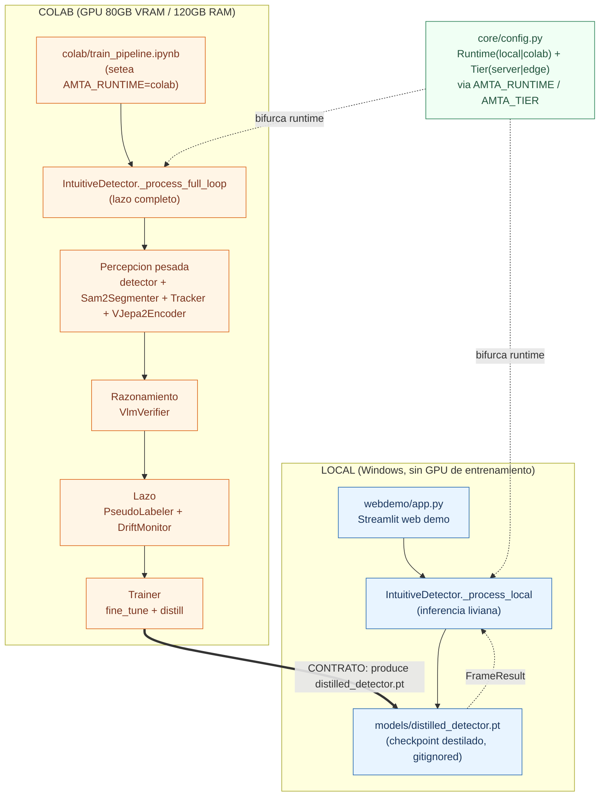
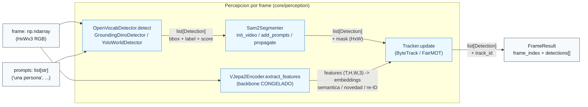
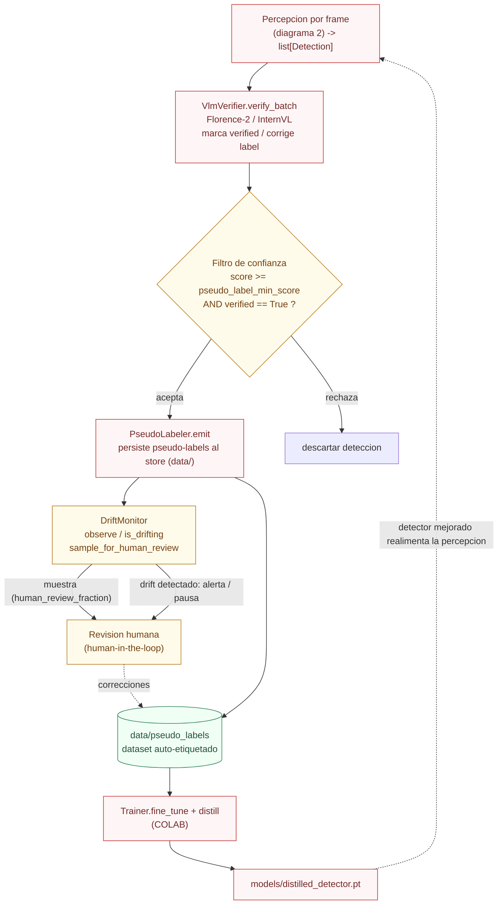
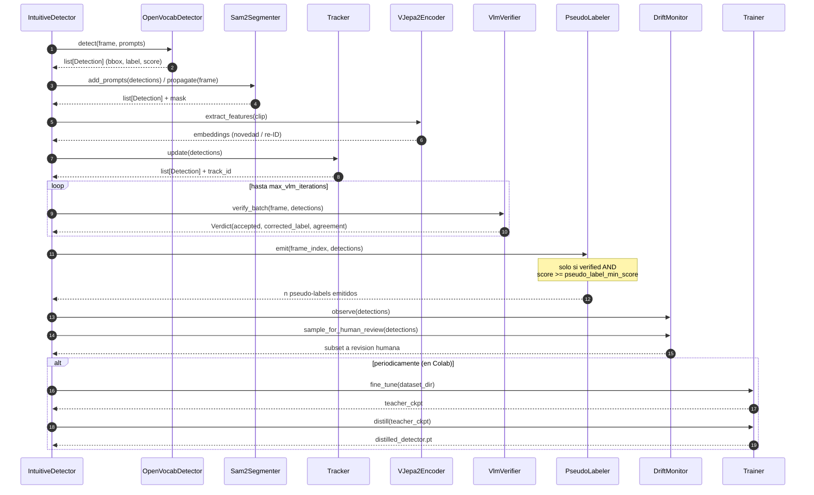
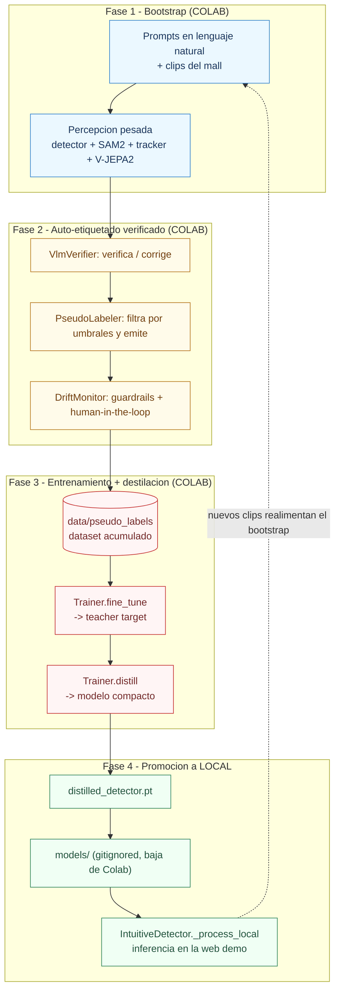
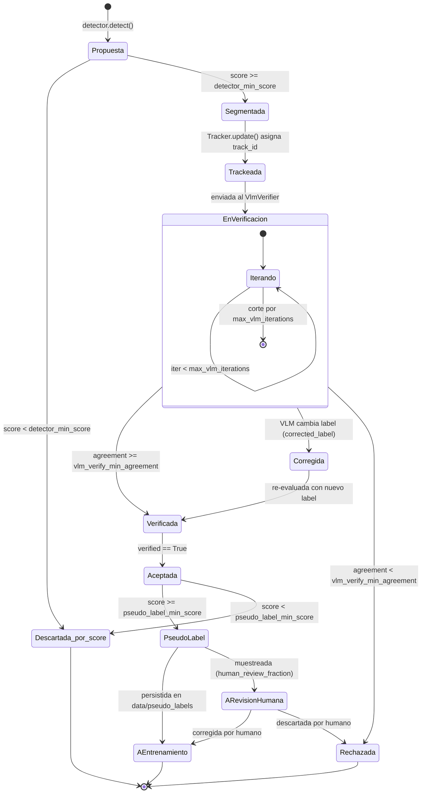
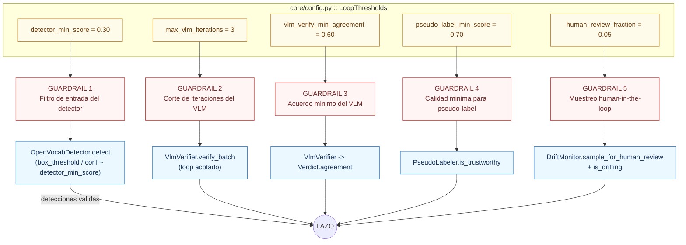

# 02 - Arquitectura del detector intuitivo auto-correctivo

> Diagramas extensivos (Mermaid + ASCII) de la arquitectura del proyecto:
> V-JEPA 2/2.1 + SAM2 + detector open-vocabulary + VLM verificador, dentro de un
> lazo de auto-correccion que genera pseudo-labels verificados, reentrena y destila
> un detector. Caso de referencia: analitica de personas en un mall, camara fija.
>
> Todas las etiquetas dentro de los nodos Mermaid van **sin tildes** (para evitar
> problemas de render). El texto explicativo de cada diagrama si lleva tildes.
> Los nombres de clases, modulos, tipos y umbrales son **identicos a los del codigo**
> (`core/`), no inventados.

## Indice de diagramas

1. [Vista de sistema: topologia LOCAL vs COLAB](#1-vista-de-sistema-topologia-local-vs-colab)
2. [Pipeline de percepcion por frame](#2-pipeline-de-percepcion-por-frame)
3. [El lazo de auto-correccion (ciclo central)](#3-el-lazo-de-auto-correccion-ciclo-central)
4. [Diagrama de secuencia de una iteracion del lazo](#4-diagrama-de-secuencia-de-una-iteracion-del-lazo)
5. [Ciclo de vida de entrenamiento, destilacion y promocion del modelo](#5-ciclo-de-vida-de-entrenamiento-destilacion-y-promocion-del-modelo)
6. [Maquina de estados de una deteccion](#6-maquina-de-estados-de-una-deteccion)
7. [Mapa de guardrails y umbrales de LoopThresholds](#7-mapa-de-guardrails-y-umbrales-de-loopthresholds)

---

## 1. Vista de sistema: topologia LOCAL vs COLAB

**Explicacion.** El sistema tiene dos lados con responsabilidades estrictamente
separadas. En **LOCAL** (la maquina Windows del usuario, sin GPU de entrenamiento)
solo corre la web demo (`webdemo/app.py`, Streamlit) y la **inferencia liviana**
del modelo ya destilado, a traves de `IntuitiveDetector._process_local`, que carga
`models/distilled_detector.pt`. En **COLAB** (GPU de 80GB) ocurre todo el heavy
lifting: el pipeline de percepcion pesado, el VLM verificador, el lazo de
pseudo-labeling/guardrails y el entrenamiento/destilacion, orquestado por
`IntuitiveDetector._process_full_loop`. El switch lo determina `core/config.py`
leyendo las variables de entorno `AMTA_RUNTIME` (`local`|`colab`) y `AMTA_TIER`
(`server`|`edge`). El **contrato** que une ambos lados es unidireccional: Colab
entrena y destila, produce `distilled_detector.pt`, y ese unico artefacto **baja a
`models/`** para que el lado local lo consuma. Nunca se cargan V-JEPA2/SAM2/VLM ni
se entrena en local (de hecho `Trainer.__init__` lanza `RuntimeError` si se
instancia en runtime local).

---

## 2. Pipeline de percepcion por frame

**Explicacion.** Este es el camino que recorre **un frame** en el lado pesado.
Primero el **detector open-vocabulary** (`OpenVocabDetector.detect`, implementado
por `GroundingDinoDetector` o `YoloWorldDetector`) propone cajas a partir de los
`prompts` en lenguaje natural; su salida es una `list[Detection]` con `bbox`,
`label` y `score`. Esas detecciones pasan a **`Sam2Segmenter`**, que con `add_prompts`
refina cada caja a una **mascara binaria** (`Detection.mask`) y con `init_video` /
`propagate` mantiene **memoria temporal** para arrastrar mascaras frame a frame.
Luego el **`Tracker.update`** (ByteTrack/FairMOT) asocia cada deteccion con su
trayectoria y le asigna un **`track_id`** estable, lo que permite contar instancias
unicas (`Tracker.unique_count`). En paralelo, el **`VJepa2Encoder`** (backbone
**congelado** de V-JEPA 2.1) extrae embeddings espaciotemporales del clip; no produce
cajas ni mascaras, sino senales de semantica, novedad y re-identificacion que
alimentan al tracker y a etapas downstream. El agregado de todo es un `FrameResult`
con la lista de `Detection` enriquecidas.

---

## 3. El lazo de auto-correccion (ciclo central)

**Explicacion.** Este es el corazon del proyecto: el **lazo de auto-correccion**.
Las detecciones que salen de la percepcion entran al **`VlmVerifier.verify_batch`**,
que actua como verificador externo (los VLM son malos auto-corrigiendose pero buenos
verificando): por cada deteccion dudosa decide si la acepta, la descarta o **corrige
su `label`**, marcando `Detection.verified`. Luego un **filtro de confianza** deja
pasar solo lo que cumple `score >= pseudo_label_min_score` **y** esta verificado (la
logica vive en `PseudoLabeler.is_trustworthy`). Lo que pasa se convierte en
**pseudo-label** via `PseudoLabeler.emit`, que escribe al store `data/pseudo_labels`.
El **`DriftMonitor`** vigila la salud del lazo: registra confianzas (`observe`),
detecta degradacion (`is_drifting`) y **samplea un porcentaje** de detecciones para
revision humana (`sample_for_human_review`), evitando el **confirmation bias** (que el
modelo refuerce sus propios errores). El dataset auto-etiquetado alimenta al
**`Trainer`** (en Colab), que afina y destila el modelo; el `distilled_detector.pt`
resultante mejora la percepcion y cierra el **ciclo**.

---

## 4. Diagrama de secuencia de una iteracion del lazo

**Explicacion.** La secuencia muestra **una iteracion completa** del lazo en Colab,
orquestada por `IntuitiveDetector._process_full_loop`. Primero la percepcion:
el `OpenVocabDetector` propone cajas, `Sam2Segmenter` agrega mascaras con memoria
temporal, `VJepa2Encoder` aporta embeddings y `Tracker` asigna `track_id`. Despues
viene la verificacion: el **`VlmVerifier`** se llama dentro de un bucle acotado a
**`max_vlm_iterations`** (mas de ~3 iteraciones tiende a sobre-corregir), devolviendo
un **`Verdict`** con `accepted`, `corrected_label` y `agreement`. El `PseudoLabeler`
emite labels solo para lo verificado y confiable. El `DriftMonitor` observa y samplea
para revision humana. Finalmente, **de forma periodica** (no en cada frame), el
`Trainer` ejecuta `fine_tune` y luego `distill`, produciendo el checkpoint compacto
que baja a local.

---

## 5. Ciclo de vida de entrenamiento, destilacion y promocion del modelo

**Explicacion.** El ciclo de vida del modelo atraviesa cuatro fases. En la **Fase 1
(Bootstrap)** se arranca solo con prompts en lenguaje natural y clips del mall, y la
percepcion pesada produce detecciones iniciales sin clases pre-entrenadas. En la
**Fase 2 (Auto-etiquetado verificado)** el `VlmVerifier` corrige, el `PseudoLabeler`
filtra por los umbrales y emite pseudo-labels, y el `DriftMonitor` aplica los
guardrails y separa muestras para revision humana. En la **Fase 3 (Entrenamiento +
destilacion)** el `Trainer` consume el dataset acumulado en `data/pseudo_labels`:
`fine_tune` produce un teacher target y `distill` lo comprime a un modelo compacto.
En la **Fase 4 (Promocion)** el `distilled_detector.pt` baja a `models/` y queda
disponible para `IntuitiveDetector._process_local`, que lo usa en la web demo. Los
nuevos clips que se ven en produccion realimentan el bootstrap, haciendo el sistema
iterativo y cada vez mas autonomo.

---

## 6. Maquina de estados de una deteccion

**Explicacion.** Esta maquina de estados sigue el ciclo de vida de **una sola
deteccion**. Nace como **Propuesta** del detector open-vocab; si su `score` no supera
`detector_min_score` se descarta de inmediato. Si sobrevive, pasa por **Segmentada**
(SAM2) y **Trackeada** (recibe `track_id`), y entra a **EnVerificacion**, un
sub-estado donde el `VlmVerifier` itera **acotado a `max_vlm_iterations`**. Segun el
`Verdict`, la deteccion queda **Verificada** (acuerdo suficiente), **Corregida** (el
VLM le cambia el `label` y se re-evalua) o **Rechazada** (acuerdo por debajo de
`vlm_verify_min_agreement`). Una deteccion verificada se vuelve **Aceptada**, y solo
si su score supera `pseudo_label_min_score` se promueve a **PseudoLabel**. Desde ahi,
o va directo **AEntrenamiento** (persistida en `data/pseudo_labels`), o si fue
muestreada por `human_review_fraction` pasa **ARevisionHumana**, donde un humano la
corrige (y entonces va a entrenamiento) o la descarta.

---

## 7. Mapa de guardrails y umbrales de LoopThresholds

**Explicacion.** El proyecto centraliza todos sus guardrails anti confirmation-bias
en `core/config.py::LoopThresholds`, y cada umbral se traduce en un punto concreto de
control dentro del lazo. **`detector_min_score` (0.30)** filtra la entrada del
detector open-vocab, descartando propuestas debiles (se corresponde con el
`box_threshold`/`conf` de `GroundingDinoDetector`/`YoloWorldDetector`).
**`max_vlm_iterations` (3)** acota el bucle del `VlmVerifier` para evitar la
sobre-correccion (mas de ~3 pasadas degrada el resultado). **`vlm_verify_min_agreement`
(0.60)** define el acuerdo minimo del VLM para aceptar un `Verdict`.
**`pseudo_label_min_score` (0.70)** es el corte de calidad que aplica
`PseudoLabeler.is_trustworthy` antes de convertir una deteccion en pseudo-label
(solo lo muy confiable y verificado entra al dataset). **`human_review_fraction`
(0.05)** gobierna cuanto muestrea el `DriftMonitor` para revision humana, el seguro
ultimo contra que el lazo refuerce sus propios errores. La regla del proyecto es
inviolable: cualquier cambio al lazo debe respetar estos umbrales y leerlos siempre
desde `core/config.py`, nunca hardcodeados.

---

### Referencias de componentes (ver `papers.md`, `CLAUDE.md` y [`03_estado_del_arte.md`](03_estado_del_arte.md))

- **V-JEPA 2** (arxiv 2506.09985) y **V-JEPA 2.1** (arxiv 2603.14482, verificado 2026-06-17) -> `VJepa2Encoder`
- **SAM 2** (arxiv 2408.00714) -> `Sam2Segmenter`
- **Grounding DINO** (arxiv 2303.05499) y **YOLO-World** (arxiv 2401.17270) -> `OpenVocabDetector`
- **Florence-2** / **InternVL** -> `VlmVerifier`
- **ByteTrack** / **FairMOT** -> `Tracker`
- **Mask2Former** (arxiv 2112.01527), **Autodistill** -> referencias de destilacion/segmentacion
